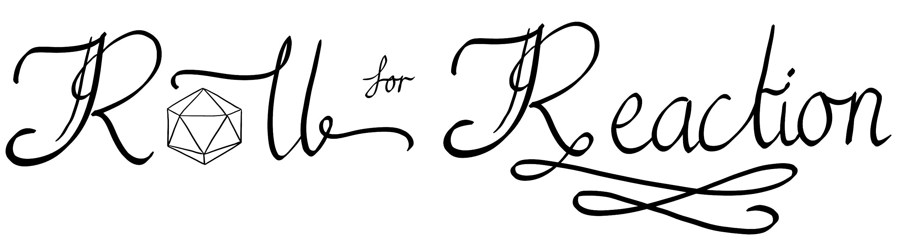

# Roll For Reaction
<!-- ALL-CONTRIBUTORS-BADGE:START - Do not remove or modify this section -->

<!-- ALL-CONTRIBUTORS-BADGE:END -->
#### SOFTENG 750/COMPSCI 732

*Roll For Reaction* is an open-source fork of [react-rpg](https://github.com/ASteinheiser/react-rpg.com) created for SOFTENG750/COMPSCI 732 at the University of Auckland. This project aims to enhance the systems already present in the base game by modifying and adding elements to lightly emulate the popular tabletop role-playing game *Dungeons and Dragons: 5th Edition*. In doing so, the following features are planned to be added:

| Definitely                                                                                                                                                                                                                                                                                 | Hopefully                                                                                                                                                                                                                                                                                          | Maybe                                                                                                                                                                                                                                                                            |
| ------------------------------------------------------------------------------------------------------------------------------------------------------------------------------------------------------------------------------------------------------------------------------------------ | -------------------------------------------------------------------------------------------------------------------------------------------------------------------------------------------------------------------------------------------------------------------------------------------------- | -------------------------------------------------------------------------------------------------------------------------------------------------------------------------------------------------------------------------------------------------------------------------------- |
| <svg viewBox="0 0 12 16" version="1.1" width="12" height="16" aria-hidden="true"><path fill-rule="evenodd" fill="red" d="M7.48 8l3.75 3.75-1.48 1.48L6 9.48l-3.75 3.75-1.48-1.48L4.52 8 .77 4.25l1.48-1.48L6 6.52l3.75-3.75 1.48 1.48L7.48 8z"></path></svg> DnD Ability Scores for Player | <svg viewBox="0 0 12 16" version="1.1" width="12" height="16" aria-hidden="true"><path fill-rule="evenodd" fill="red" d="M7.48 8l3.75 3.75-1.48 1.48L6 9.48l-3.75 3.75-1.48-1.48L4.52 8 .77 4.25l1.48-1.48L6 6.52l3.75-3.75 1.48 1.48L7.48 8z"></path></svg> UI/UX Improvements                    | <svg viewBox="0 0 12 16" version="1.1" width="12" height="16" aria-hidden="true"><path fill-rule="evenodd" fill="red" d="M7.48 8l3.75 3.75-1.48 1.48L6 9.48l-3.75 3.75-1.48-1.48L4.52 8 .77 4.25l1.48-1.48L6 6.52l3.75-3.75 1.48 1.48L7.48 8z"></path></svg> Particle Effects    |
| <svg viewBox="0 0 12 16" version="1.1" width="12" height="16" aria-hidden="true"><path fill-rule="evenodd" fill="red" d="M7.48 8l3.75 3.75-1.48 1.48L6 9.48l-3.75 3.75-1.48-1.48L4.52 8 .77 4.25l1.48-1.48L6 6.52l3.75-3.75 1.48 1.48L7.48 8z"></path></svg> DnD Classes and Races         | <svg viewBox="0 0 12 16" version="1.1" width="12" height="16" aria-hidden="true"><path fill-rule="evenodd" fill="red" d="M7.48 8l3.75 3.75-1.48 1.48L6 9.48l-3.75 3.75-1.48-1.48L4.52 8 .77 4.25l1.48-1.48L6 6.52l3.75-3.75 1.48 1.48L7.48 8z"></path></svg> Final Fantasy-esque Turn Based Combat | <svg viewBox="0 0 12 16" version="1.1" width="12" height="16" aria-hidden="true"><path fill-rule="evenodd" fill="red" d="M7.48 8l3.75 3.75-1.48 1.48L6 9.48l-3.75 3.75-1.48-1.48L4.52 8 .77 4.25l1.48-1.48L6 6.52l3.75-3.75 1.48 1.48L7.48 8z"></path></svg> Character Dialogue  |
| <svg viewBox="0 0 12 16" version="1.1" width="12" height="16" aria-hidden="true"><path fill-rule="evenodd" fill="red" d="M7.48 8l3.75 3.75-1.48 1.48L6 9.48l-3.75 3.75-1.48-1.48L4.52 8 .77 4.25l1.48-1.48L6 6.52l3.75-3.75 1.48 1.48L7.48 8z"></path></svg> Dice-based Combat             | <svg viewBox="0 0 12 16" version="1.1" width="12" height="16" aria-hidden="true"><path fill-rule="evenodd" fill="green" d="M12 5l-8 8-4-4 1.5-1.5L4 10l6.5-6.5L12 5z"></path></svg> Save/Load System                                                                                               | <svg viewBox="0 0 12 16" version="1.1" width="12" height="16" aria-hidden="true"><path fill-rule="evenodd" fill="red" d="M7.48 8l3.75 3.75-1.48 1.48L6 9.48l-3.75 3.75-1.48-1.48L4.52 8 .77 4.25l1.48-1.48L6 6.52l3.75-3.75 1.48 1.48L7.48 8z"></path></svg> Cinematic Cutscenes |
| <svg viewBox="0 0 12 16" version="1.1" width="12" height="16" aria-hidden="true"><path fill-rule="evenodd" fill="red" d="M7.48 8l3.75 3.75-1.48 1.48L6 9.48l-3.75 3.75-1.48-1.48L4.52 8 .77 4.25l1.48-1.48L6 6.52l3.75-3.75 1.48 1.48L7.48 8z"></path></svg> New Maps/Levels               | <svg viewBox="0 0 12 16" version="1.1" width="12" height="16" aria-hidden="true"><path fill-rule="evenodd" fill="red" d="M7.48 8l3.75 3.75-1.48 1.48L6 9.48l-3.75 3.75-1.48-1.48L4.52 8 .77 4.25l1.48-1.48L6 6.52l3.75-3.75 1.48 1.48L7.48 8z"></path></svg> New Enemy Types                       | <svg viewBox="0 0 12 16" version="1.1" width="12" height="16" aria-hidden="true"><path fill-rule="evenodd" fill="red" d="M7.48 8l3.75 3.75-1.48 1.48L6 9.48l-3.75 3.75-1.48-1.48L4.52 8 .77 4.25l1.48-1.48L6 6.52l3.75-3.75 1.48 1.48L7.48 8z"></path></svg> Online Multiplayer  |
| <svg viewBox="0 0 12 16" version="1.1" width="12" height="16" aria-hidden="true"><path fill-rule="evenodd" fill="green" d="M12 5l-8 8-4-4 1.5-1.5L4 10l6.5-6.5L12 5z"></path></svg> Character Creation                                                                                     | <svg viewBox="0 0 12 16" version="1.1" width="12" height="16" aria-hidden="true"><path fill-rule="evenodd" fill="red" d="M7.48 8l3.75 3.75-1.48 1.48L6 9.48l-3.75 3.75-1.48-1.48L4.52 8 .77 4.25l1.48-1.48L6 6.52l3.75-3.75 1.48 1.48L7.48 8z"></path></svg> Customisable Outfit Colour            | <svg viewBox="0 0 12 16" version="1.1" width="12" height="16" aria-hidden="true"><path fill-rule="evenodd" fill="red" d="M7.48 8l3.75 3.75-1.48 1.48L6 9.48l-3.75 3.75-1.48-1.48L4.52 8 .77 4.25l1.48-1.48L6 6.52l3.75-3.75 1.48 1.48L7.48 8z"></path></svg> Party System        |
| <svg viewBox="0 0 12 16" version="1.1" width="12" height="16" aria-hidden="true"><path fill-rule="evenodd" fill="red" d="M7.48 8l3.75 3.75-1.48 1.48L6 9.48l-3.75 3.75-1.48-1.48L4.52 8 .77 4.25l1.48-1.48L6 6.52l3.75-3.75 1.48 1.48L7.48 8z"></path></svg> Additional Items in Shop      | <svg viewBox="0 0 12 16" version="1.1" width="12" height="16" aria-hidden="true"><path fill-rule="evenodd" fill="red" d="M7.48 8l3.75 3.75-1.48 1.48L6 9.48l-3.75 3.75-1.48-1.48L4.52 8 .77 4.25l1.48-1.48L6 6.52l3.75-3.75 1.48 1.48L7.48 8z"></path></svg> Split Screen Local Multiplayer        |                                                                                                                                                                                                                                                                                  |
| <svg viewBox="0 0 12 16" version="1.1" width="12" height="16" aria-hidden="true"><path fill-rule="evenodd" fill="red" d="M7.48 8l3.75 3.75-1.48 1.48L6 9.48l-3.75 3.75-1.48-1.48L4.52 8 .77 4.25l1.48-1.48L6 6.52l3.75-3.75 1.48 1.48L7.48 8z"></path></svg> Spellcasting System           |                                                                                                                                                                                                                                                                                                    |                                                                                                                                                                                                                                                                                  |

> Classes include Fighter, Ranger and Wizard

> Races include Human, Elf and Dwarf

## Developer Instructions

The game is hosted via GitHub pages at https://matteas.nz/roll-for-reaction, but for development purposes it is a requirement to be able to run the game locally.

#### Requirements
In order to run *Roll for Reaction* locally, you must ensure you have setup, installed and tested:
- `git`
- `yarn`

This implementation is fully supported and tested on Arch Linux and Windows 10.

#### Install & Setup

1. Clone the repo

    `git clone https://github.com/Matteas-Eden/roll-for-reaction`

2. Change to the directory containing the repository

    `cd roll-for-reaction`

3. Install the dependencies

   `yarn install --frozen-lockfile`

4. Start the game locally

   `yarn start`

## Contributors

Thanks goes to all of these wonderful people who helped in making this project a success. For more information on the types of contributions, [see this page](../../wiki/Contributions).
<!-- ALL-CONTRIBUTORS-LIST:START - Do not remove or modify this section -->
<!-- prettier-ignore-start -->
<!-- markdownlint-disable -->
<table>
  <tr>
    <td align="center"><a href="https://github.com/Pyxxil"> <b>Josh Hill</b></a> <a href="https://github.com/matteas-eden/roll-for-reaction/commits?author=Pyxxil" title="Code">💻</a> <a href="#ideas-Pyxxil" title="Ideas, Planning, & Feedback">🤔</a> <a href="https://github.com/matteas-eden/roll-for-reaction/pulls?q=is%3Apr+reviewed-by%3APyxxil" title="Reviewed Pull Requests">👀</a> <a href="https://github.com/matteas-eden/roll-for-reaction/commits?author=Pyxxil" title="Documentation">📖</a> <a href="#maintenance-Pyxxil" title="Maintenance">🚧</a></td>
    <td align="center"><a href="https://github.com/Frosty273"> <b>Kelvin</b></a> <a href="https://github.com/matteas-eden/roll-for-reaction/commits?author=Frosty273" title="Code">💻</a> <a href="#ideas-Frosty273" title="Ideas, Planning, & Feedback">🤔</a> <a href="#design-Frosty273" title="Design">🎨</a> <a href="https://github.com/matteas-eden/roll-for-reaction/pulls?q=is%3Apr+reviewed-by%3AFrosty273" title="Reviewed Pull Requests">👀</a> <a href="https://github.com/matteas-eden/roll-for-reaction/commits?author=Frosty273" title="Documentation">📖</a> <a href="#maintenance-Frosty273" title="Maintenance">🚧</a></td>
    <td align="center"><a href="https://github.com/KimberleyEvans-Parker"> <b>Kimberley</b></a> <a href="#design-KimberleyEvans-Parker" title="Design">🎨</a> <a href="#ideas-KimberleyEvans-Parker" title="Ideas, Planning, & Feedback">🤔</a> <a href="https://github.com/matteas-eden/roll-for-reaction/commits?author=KimberleyEvans-Parker" title="Documentation">📖</a> <a href="https://github.com/matteas-eden/roll-for-reaction/pulls?q=is%3Apr+reviewed-by%3AKimberleyEvans-Parker" title="Reviewed Pull Requests">👀</a> <a href="https://github.com/matteas-eden/roll-for-reaction/commits?author=KimberleyEvans-Parker" title="Code">💻</a> <a href="#maintenance-KimberleyEvans-Parker" title="Maintenance">🚧</a></td>
    <td align="center"><a href="http://matteas.nz"> <b>Matt Eden</b></a> <a href="https://github.com/matteas-eden/roll-for-reaction/commits?author=Matteas-Eden" title="Code">💻</a> <a href="https://github.com/matteas-eden/roll-for-reaction/commits?author=Matteas-Eden" title="Documentation">📖</a> <a href="#ideas-Matteas-Eden" title="Ideas, Planning, & Feedback">🤔</a> <a href="https://github.com/matteas-eden/roll-for-reaction/pulls?q=is%3Apr+reviewed-by%3AMatteas-Eden" title="Reviewed Pull Requests">👀</a> <a href="#maintenance-Matteas-Eden" title="Maintenance">🚧</a></td>
  </tr>
</table>

<!-- markdownlint-enable -->
<!-- prettier-ignore-end -->
<!-- ALL-CONTRIBUTORS-LIST:END -->
